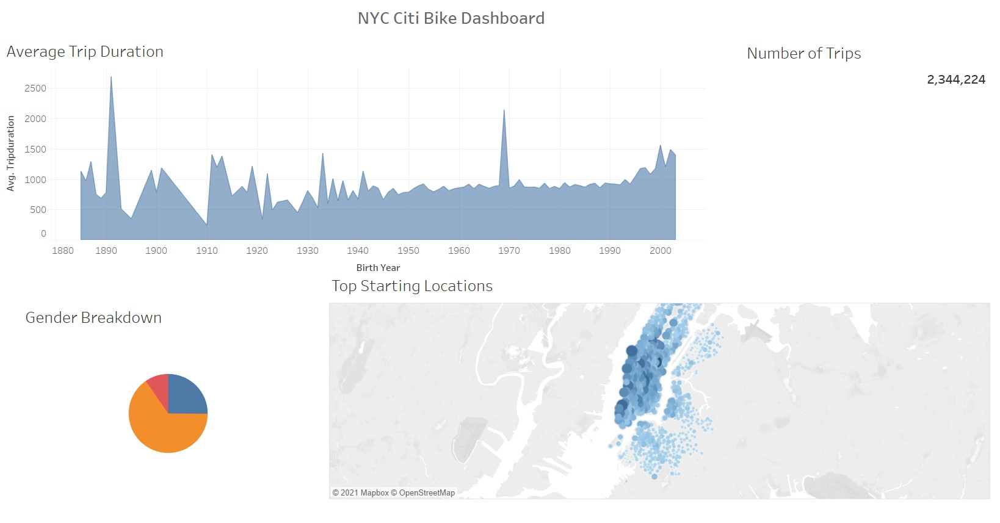
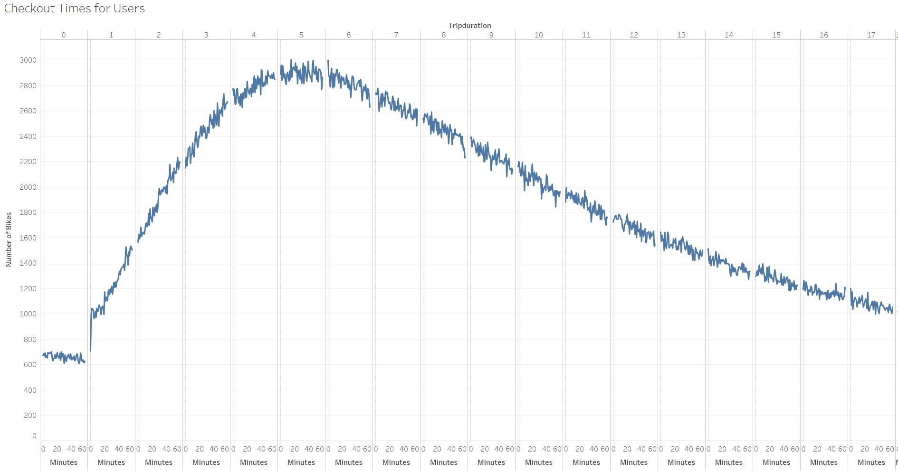
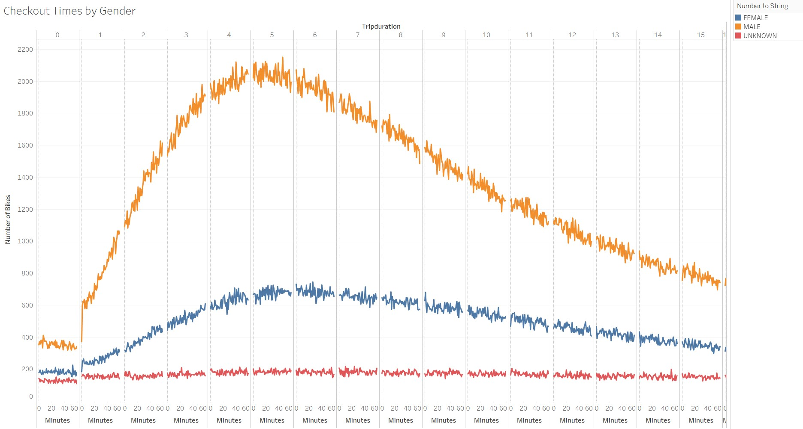
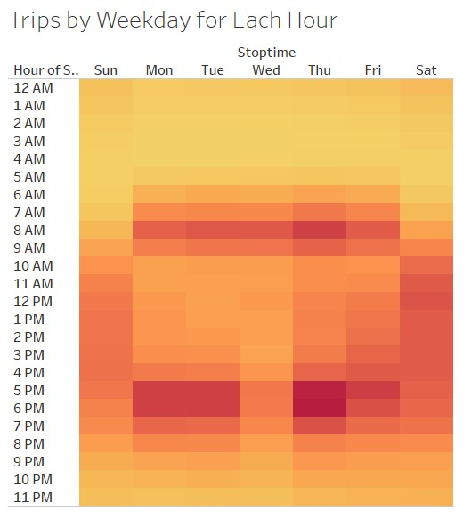
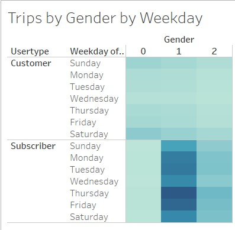
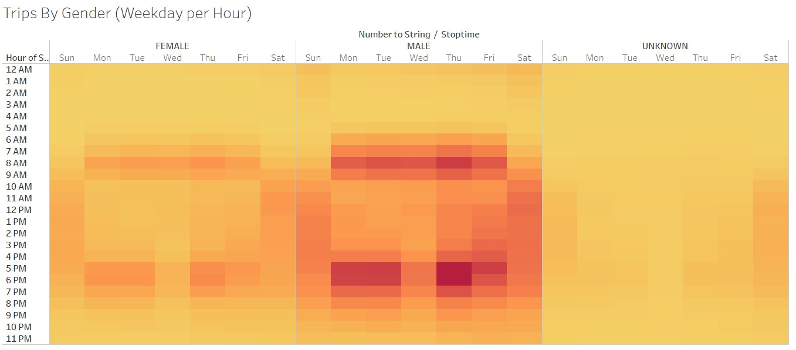

## Would Des Moines, Iowa be a profitable bikesharing market? 

### Overview of the Statistical Analysis

The Citibike Analysis has been conducted to breakdown the likely hood of Des Moines, Iowa being a profitable market for a bikesharing business like Citibike in Manhattan. All data that is being analyzed if from New York and not from Iowa. It is a research and analysis on if the current large market is thriving and a look at what can be done to make this same process relevant in Des Moines.

***

### Results

#### Average Trip Duration

The average trip duration graph wasn't as useful as some of the other visualizations. It lacked information. Were these people with the earlier birth years riding as of now? Was this data comparing those who rode bikes then in this area each year? it wasn't as clear to me, so therefore I didn't find this as useful. However, I did find it interesting that there was a sharp spike in trip duration for bike riding around the early 70's. 

#### Top Starting Locations

The main takeaway simply from the visual was that the starting location were from a particular side of the edge of the city or dead center in the city. Riders are going to want to ride into the city or strat in the city and ride around and explore landmarks top listed to do items. 

#### Gender Breakdown

The gender breakdown helps identify the target audience and who should be marketed to in Des Moines. We are clearly looking at a male heavy market. A little over 65% of the market is male with female around 25% and unknown about 10%.

#### Checkout Times for Users

Bikes are checked out for a generous amount of time according to the data. 5 hours is the peak amount of times but also the length of time but also the length of time a large amount of bikes are checked out. Letting us know that bike aren't just being used for work and school commutes in the city they are being used for other activities.

#### Checkout Times by Gender

Males checkout bikes for more frequently than everyone else. However the duration in which the bikes are checked out are consistent. The most popular time being about 5 hours. At the 5 hour duration Males check out on average a little over 2,000 bikes and Females right around 700. 

#### Trips by Weekday per Hour

Mondays-Thursdays, 10:00AM-3:00PM, are slower than other days. Friday-Sunday is consistently busy and weekday morning and evening rush hour. Wednesdays in general looks to be the slowest day. Making it a good day for significant repairs in high bike activity areas.

#### Trips by Gender by Weekday

This visualization shows us the relation between male and female riders and those who either chose not to answer or may be gender fluid, and the amount of trips they take using Citibike per weekday. This data shows us that males and those who identify as male overall ride more frequently. It also show that most of those riders aren't just customers they are subscribers of the Citibike service.

#### Trips by Gender by Weekday per Hour (Combination of previous two)

This visualization is a combination of the two above. It reiterates that Wednesdays are slow and that males are dominant riders. It also shows us a bit more clearly the dead times each day from midnight to 5:00AM as well. 

### Summary

This summary was primarily based on New York data. With this data it shows that a bikesharing business may be pretty profitable. However, in-depth research needs to be completed on the Des Moines market and the city is not nearly as large as the borough of Manhattan. College towns and downtown areas could make it a thriving seasonal business. 

Before researching Des Moines, I would suggest finding better examples to show the risk for Bike Repairs and the level of bike utilization. Those graphs were not the best if you are trying to get down to a financial visual. When presenting in a boardroom, all they really want to know is about the money (Production Cost, ROI, Labor, etc.). These fall short of producing those a visual of those particulars indirectly or directly.
